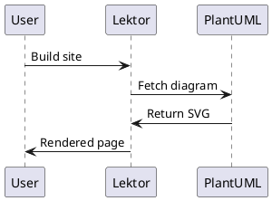

# Lektor PlantUML Plugin

A Lektor plugin that renders PlantUML diagrams from fenced code blocks in markdown.

## Features

- Renders PlantUML diagrams as inline SVG at build time
- In-memory caching to avoid redundant requests
- Configurable server URL and timeout
- Works seamlessly with other markdown plugins

## Installation

This plugin is installed as a local package in editable mode:

```bash
cd packages/lektor-plantuml
pip install -e .
```

## Usage

In your markdown content, use a fenced code block with `plantuml` as the language:

````markdown

````

The plugin will automatically:
1. Encode the PlantUML text
2. Fetch the rendered SVG from the PlantUML server
3. Embed the SVG inline in your HTML

## Configuration

Create a `configs/plantuml.ini` file to customize the plugin:

```ini
[plantuml]
# PlantUML server URL (default: http://www.plantuml.com/plantuml)
server = http://www.plantuml.com/plantuml

# Request timeout in seconds (default: 120)
# Increase this if you have complex diagrams that take longer to render
timeout = 120
```

### Configuration Options

- **server**: The PlantUML server URL. You can use:
  - Public server: `http://www.plantuml.com/plantuml` (default)
  - Local server: `http://localhost:8080` (if running PlantUML locally)
  - Other public instances

- **timeout**: Request timeout in seconds (default: 120)
  - Increase this value if you're getting timeout errors
  - Complex diagrams may take longer to render
  - The plugin caches results, so timeouts only affect the first render

## Caching

The plugin uses in-memory caching to avoid re-fetching diagrams that haven't changed. The cache is keyed by the diagram text, so:

- Same diagram in multiple places = fetched once
- Modified diagram = fetched again
- Cache persists for the duration of the build

## Error Handling

If the PlantUML server is unreachable or times out, the plugin will:
- Display an error message in the rendered HTML
- Not break the build process
- Show the error details for debugging

Example error output:
```html
<div class="plantuml-error">PlantUML Error: HTTPConnectionPool(host='www.plantuml.com', port=80): Read timed out.</div>
```

## Styling

The plugin wraps rendered diagrams in a `<div class="plantuml-diagram">` element. You can style this in your CSS:

```css
.plantuml-diagram {
    text-align: center;
    margin: 2em 0;
}

.plantuml-diagram svg {
    max-width: 100%;
    height: auto;
}

.plantuml-error {
    padding: 1em;
    background: #fee;
    border: 1px solid #c00;
    border-radius: 4px;
    color: #c00;
}
```

## Compatibility

- Works with mistune 0.8.x (Lektor's default markdown parser)
- Compatible with other markdown plugins (like lektor-markdown-highlighter)
- The plugin inserts itself first in the renderer chain to handle PlantUML blocks before syntax highlighting

## License

MIT
